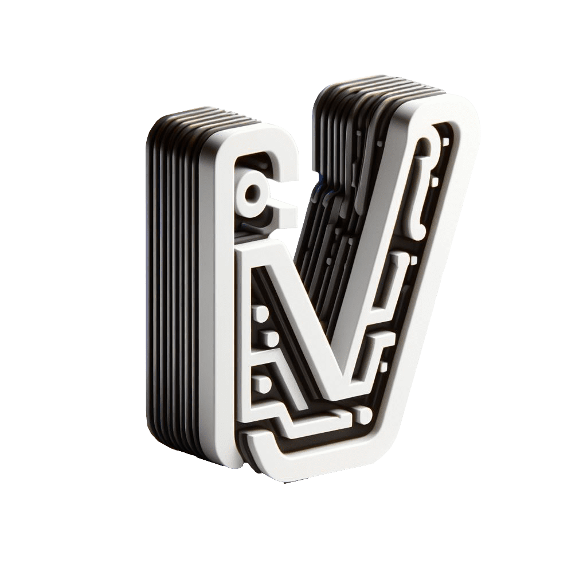

  
   
  

    
  

Based in Buenos Aires, I’ve been working with <strong>Python</strong> since October 2020, when I started learning to program. I also have experience in frontend development using <strong>Vanilla JS, React.js, Astro.js, Vue.js,</strong> and <strong>Node.js</strong>, integrating them with Python backends and AI. I’ve worked with cloud services like <strong>AWS, Azure,</strong> and <strong>GCP</strong>. I’m dedicated to <strong>learning</strong> and always give my best, with <strong>commitment and high standards</strong>. I’m looking to join a team where I can continue to grow and contribute.

  

### 🛠️ Tech Stack:

  

  
  

  

 

  

  
  
### 📧 How to Reach Me:
Email: [contact@ivanluna.dev](https://ivanluna.dev/contact/)

